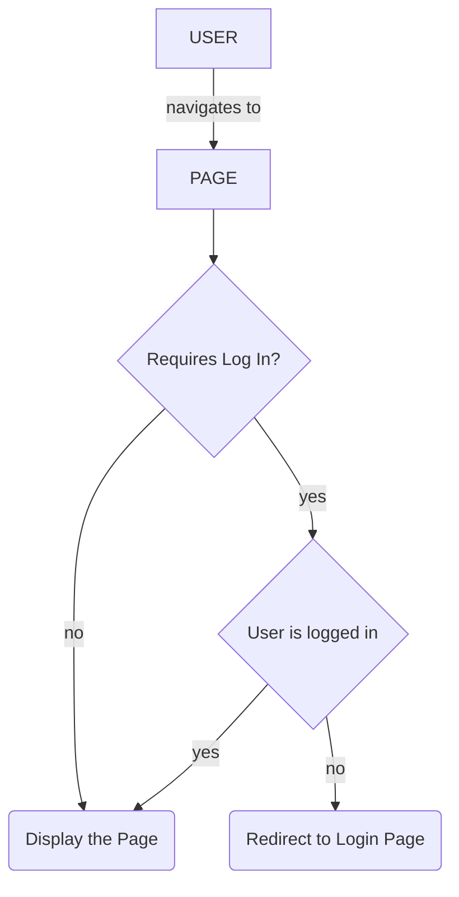

# Oh My Admin 

### tsconfig.json component library path comparison

| root tsconfig.json uses dist path                                            | root tsconfig.json uses project path                                              |
|------------------------------------------------------------------------------|-----------------------------------------------------------------------------------|
| requires component-library to be built first before serving the kitchen-sink | DOES NOT requires component-library to be built first before serving kitchen-sink |
| component definitions are the compiled versions                              | component definitions go to the uncompiled version                                |
| not a great development experience                                           | great for local development                                                       |
| mimics production setup                                                      | does not mimic production                                                         |
| will show production related packaging errors                                | can hide errors relating to packaging                                             |
| faster builds                                                                | slower builds                                                                     |
| stronger decoupling                                                          |                                                                                   |
| no live reloading                                                            | live reloading when changes are made in the component-library                     |

---

# TODO: 
* [ ] SSR
* [ ] Log everything
  * [ ] log to file until a logger is added
* [ ] Global Toast Service that can be triggered from ANYWHERE like:
  * `this.toast.error("some new error")`
* [ ] E2E Testing
* [ ] Theme file, perhaps a json file
  * See the component library for this
  * Users can live edit their palette
  * Users can then save those customizations with will use SSR to save the file and serve those changes next time
  * Users can also reset to the original
  * Predefined palettes
* [ ] Palette Visualizer (https://coolors.co/visualizer/4b7f52-7dd181-96e8bc-b6f9c9-c9ffe2)
* [ ] Palette Inspo: https://anice.red/
* [ ] Pagination on tables should affect the URL so that its shareable
